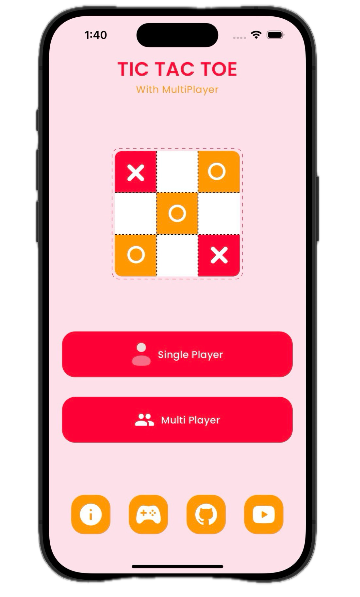

# Tic Tac Toe

This repository contains the source code for a Tic Tac Toe mobile application built using Flutter. The application supports both single-player and multiplayer modes, offering an engaging experience for users who enjoy playing this classic game.

## Features

- Single Player Mode: Play Offline.
- Multiplayer Mode: Play with another player online.
- User Profiles: Track wins and display user information.
- Interactive UI: Responsive and visually appealing design with real-time updates.
- Confetti Animation: Celebratory animation for game wins.

## Dependencies

The Tic Tac Toe application relies on the following dependencies:

- **cached_network_image**: For efficient image caching and loading.
- **clipboard**: To copy text to the clipboard.
- **cloud_firestore**: For real-time data storage and retrieval with Firebase Firestore.
- **concentric_transition**: For concentric page transitions.
- **confetti**: For celebratory confetti animations.
- **dotted_border**: To create dotted borders for UI elements.
- **firebase_auth**: For authentication using Firebase.
- **firebase_core**: Core functionality for Firebase integration.
- **firebase_storage**: For uploading and retrieving files from Firebase Storage.
- **flutter**: The SDK for building the application.
- **flutter_svg**: To render SVG images.
- **fluttertoast**: For displaying toast messages.
- **get**: A lightweight and powerful state management and dependency injection library.
- **google_sign_in**: For Google authentication.
- **image_picker**: For selecting images from the device's gallery or camera.
- **uuid**: To generate unique identifiers.

## Screenshots

## Installation

To run this project locally, follow these steps:

- Clone the repository:

    `git clone https://github.com/dcaayushd/tic_tac_toe.git`

- Navigate to the project directory:

    `cd tic_tac_toe`

- Install dependencies:

    `flutter pub get`

- Run the application:

    `flutter run`

## Contributing

We welcome contributions from the community! To contribute:

1. Fork the repository.
2. Create a new branch (`git checkout -b feature-branch`).
3. Make your changes and commit them (`git commit -am 'Add new feature'`).
4. Push to the branch (`git push origin feature-branch`).
5. Create a new Pull Request.

## LICENSE

This project is licensed under the MIT License - see the [License](LICENSE) file for details.

© 2024 Aayush D.C Dangi
